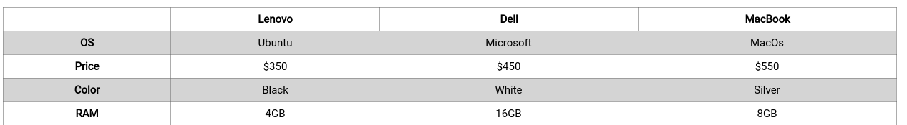
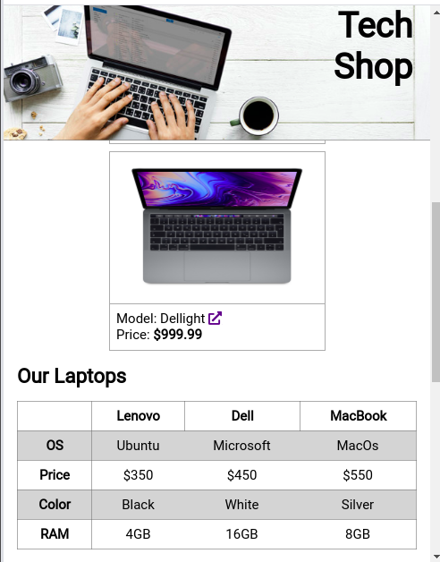

# Surfboard-Store Landing Page - responsive design with a table

## Exercise Course-Module 1 - UserInterfaceBasics (UIB) - HTML/CSS

Created at 01.11.22

#### Positioning

fixed header with background image, css-icons with pseudo-elements on attribute selector;

#### Responsive Design

in the "Product Card" section used flex to make the cards appear as a column for mobile and as a row for tablet/desktop (breakpoint: `950px`).

##### Table Data Structure

created a table with table data structure like the example belwow:

| ------    | Lenovo | Dell      | Macbook |
| --------- | ------ | --------- | ------- |
| **OS**    | Ubuntu | Microsoft | MacOS   |
| **Price** | $350   | $450      | $550    |
| **Color** | Black  | White     | Silver  |
| **RAM**   | 4GB    | 16GB      | 8GB     |

reference table:

#### Form

created a "Contact Form" with input fields for the user's name, email, textarea for a message and submit button, incl. types and placeholder text; on focus, change the outline color of the input fields and textarea change to blue.

#### Nested Links

Footer with ul of social media icons and nested anchor links

#### Image-Sources:

Header-Image2: Photo by <a href="https://unsplash.com/@amutiomi?utm_content=creditCopyText&utm_medium=referral&utm_source=unsplash">Miguel A Amutio</a> on <a href="https://unsplash.com/photos/woman-walking-on-body-of-water-carrying-green-surfboard-during-daytime-Jqfcyx7fqzo?utm_content=creditCopyText&utm_medium=referral&utm_source=unsplash">Unsplash</a>
Surfboard1: Photo by <a href="https://unsplash.com/@jeremybishop?utm_content=creditCopyText&utm_medium=referral&utm_source=unsplash">Jeremy Bishop</a> on <a href="https://unsplash.com/photos/person-on-body-of-water-carrying-red-surfboard-BCMzlf9rA0Q?utm_content=creditCopyText&utm_medium=referral&utm_source=unsplash">Unsplash</a>
Surfboard2: <a href="https://unsplash.com/@nekhaev?utm_content=creditCopyText&utm_medium=referral&utm_source=unsplash">Filipp Nekhaev</a> on <a href="https://unsplash.com/photos/woman-standing-near-sea-holding-white-blue-and-green-surfboard-under-blue-sky-Ycnt8BKlMtY?utm_content=creditCopyText&utm_medium=referral&utm_source=unsplash">Unsplash</a>
Surfboard3:Photo by <a href="https://unsplash.com/@a2eorigins?utm_content=creditCopyText&utm_medium=referral&utm_source=unsplash">Alex Perez</a> on <a href="https://unsplash.com/photos/beige-surfboards-on-the-wall-beside-the-beach-97NK3fiH7xA?utm_content=creditCopyText&utm_medium=referral&utm_source=unsplash">Unsplash</a>
